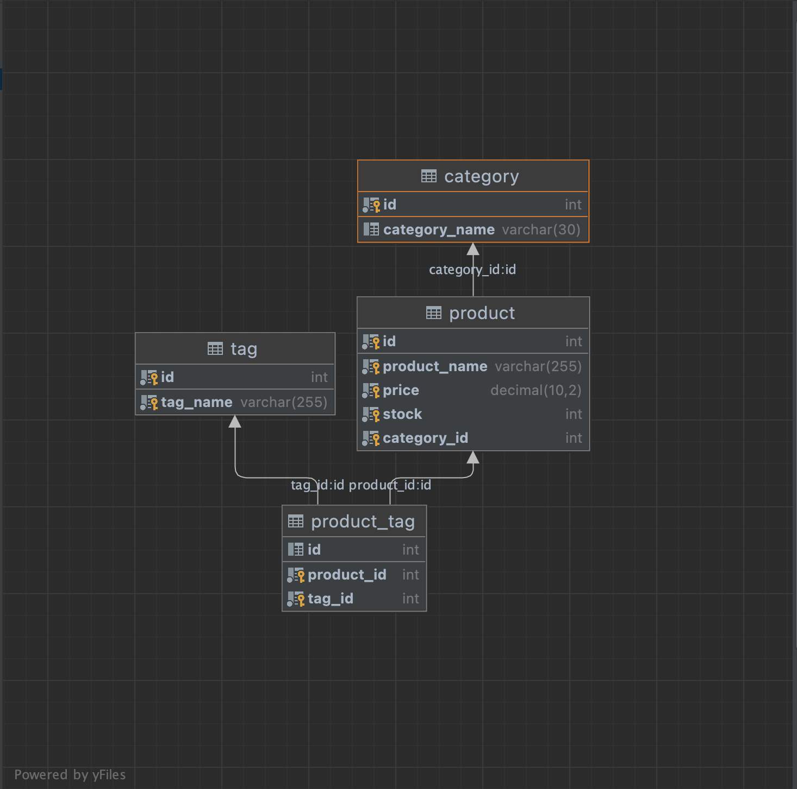
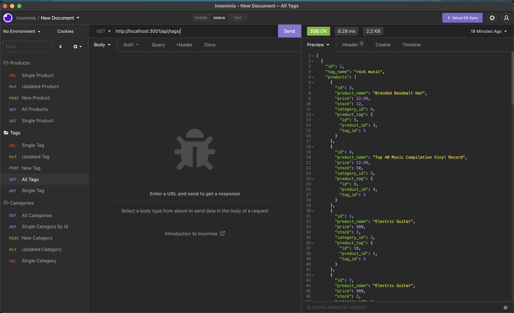

  
   
   

# eCommerce Backend

  
  This application provides the foundational backend for an eCommerce platform. It utilizes NodeJS, MySQL, Sequelize and Express to establish a lightweight framework to manage categories, products, and tags, and the relationships between them.
   
   

  ##### Table of Contents  
  [How to Install](#installation)  
  [Usage](#usage)   
  [How to Contribute](#contribution)  
  [Contact](#contact)  
   

  

  

  ## How to Install
  Clone the repo, install node by running npm i in the root directory.
   
   

  

  ## Usage
  Make sure you create the database first. To do this, login in to MySQL at the root directory and run 'source db/schema.sql'. You can now exit the MySQL shell. Then you'll want to seed the database with starter data by running 'npm run seed' at the root directory. Now you should be able to test your API routes using a tool like Insomia or Postman.
   
   

  

  

  ## How to Contribute
  Asked to be added as a collaborator, and then when you're ready to make a contribution to the codebase, submit a pull request!
   
   

  

  ## Contact
  If you have any questions, contact the administrator at:

  * [n-r-martin](github.com/n-r-martin)
  * hello@nickmartin.design
  